# 🌿 Urban Plant Rescue App - Пълна Техническа Документация

## 📖 Представяне
**Urban Plant Rescue App** е уеб базирано приложение, създадено с **ASP.NET Core 8**, което има за цел да свързва любителите на растенията и да помага 
за спасяването на градската флора. Потребителите могат да докладват за растения в нужда и да подават заявки за тяхното "осиновяване" или лечение.  
Проектът демонстрира умения за работа с релационни бази данни, сигурност, CRUD операции и модерен UI дизайн.

---

## 🚀 Технологичен Стек
Проектът използва най-модерните стандарти в разработката на уеб приложения:
### Backend:
* **Framework:** .NET 8 (LTS)
* **Language:** C# 12
* **Architecture:** Model-View-Controller (MVC)
* **Database:** Microsoft SQL Server
* **ORM:** Entity Framework Core
### Frontend:
* **Engine:** Razor Views
* **Styling:** Bootstrap 5 (Responsive Design)(мобилно-адаптивен интерфейс)
* **UX:** Custom CSS анимации и Card-based дизайн
### Сигурност:
* **Identity:** ASP.NET Core Identity (Управление на потребители, пароли и роли)

---

## 📦 Използвани NuGet Пакети
* `Microsoft.EntityFrameworkCore.SqlServer` – Свързване със SQL Server.
* `Microsoft.EntityFrameworkCore.Tools` – Команди за миграция (Add-Migration, Update-Database).
* `Microsoft.AspNetCore.Identity.EntityFrameworkCore` – Система за автентикация.

---

## 🛠 Техническа Архитектура (MVC)
Проектът следва архитектурния модел **Model-View-Controller**, осигуряващ разделение на отговорностите:
### 1. Models (Данни)
* **Plant:** Основна същност, съдържаща информация за името, описанието и визуалното представяне на растенията.
* **Category:** Дефинира типовете растения (Сукуленти, Декоративни и др.).
* **RescueRequest:** Свързваща същност (Join Entity) между потребител и растение, която следи кой иска да помогне.
* **ViewModels:** Специализирани класове (`PlantViewModel`, `RescueRequestViewModel`), които оптимизират трансфера на данни към потребителския интерфейс.
### 2. Controllers (Логика)
* **PlantController:** Управлява жизнения цикъл на растенията.
* **CategoryController:** Администрира категориите.
* **RescueRequestController:** Обработва заявките и комуникацията между потребителите и системата.

---

## 💾 База Данни и Сигурност
### Entity Framework Core
Системата използва три основни релации:
1. **Categories ↔ Plants:** One-to-Many (Една категория съдържа много растения).
2. **Users ↔ RescueRequests:** One-to-Many (Един потребител може да има много заявки).
3. **Plants ↔ RescueRequests:** One-to-Many (Едно растение може да има много заявки за спасяване).
### ASP.NET Core Identity
* **Автентикация:** Сигурна регистрация и вход на потребители.
* **Авторизация:** Използване на атрибути като `[Authorize]` и `[AllowAnonymous]` за ограничаване на достъпа до критични функции (създаване, редактиране,
изтриване).

---

## ✨ Основни функционалности:
### 🍀 Управление на растения (CRUD)
* Добавяне на нови растения със заглавие, описание, категория и URL на снимка.
* Редактиране и изтриване на съществуващи записи.
* Детайлен преглед на всяко растение с неговата история.
### 📂 Категоризация
* Динамично управление на категории (напр. Сукуленти, Стайни, Външни).
### 📩 Заявки за спасяване (Rescue Requests)
* **Interactive Requests:** Логнатите Потребителите могат да изпращат заявки за спасяването на конкретни растения.
* **Contextual Views:** Списък със заявки за конкретно растение, визуално интегриран в неговата страница "Details".
* **Status Tracking:** Проследяване на състоянието на заявката (Pending, Approved и др.).
### 🔒 Сигурност и Роли
* Система за регистрация и вход.
* Ограничен достъп: Само логнати потребители могат да създават заявки или да добавят растения.
* UI Helpers: Използване на икони и цветови кодове (зелено за активни, жълто за изчакване) за по-добър потребителски опит.
* Валидация на данни: Всички форми използват Data Annotations ([Required], [StringLength]) за предотвратяване на грешни данни.
* Защита на административните функции.

---

## 📸 Екрани снимки (Галерия)
### Начална Страница
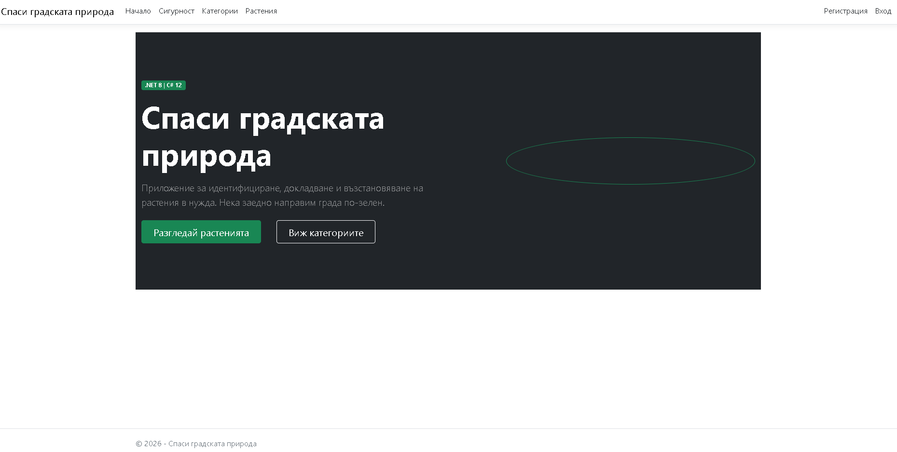

### Страница за политика на поверителност
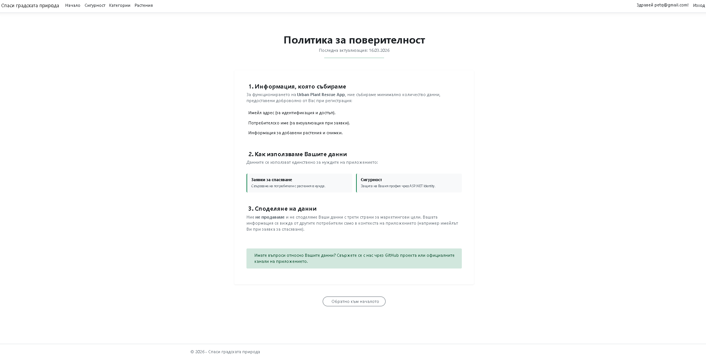

### Страница за регистрация
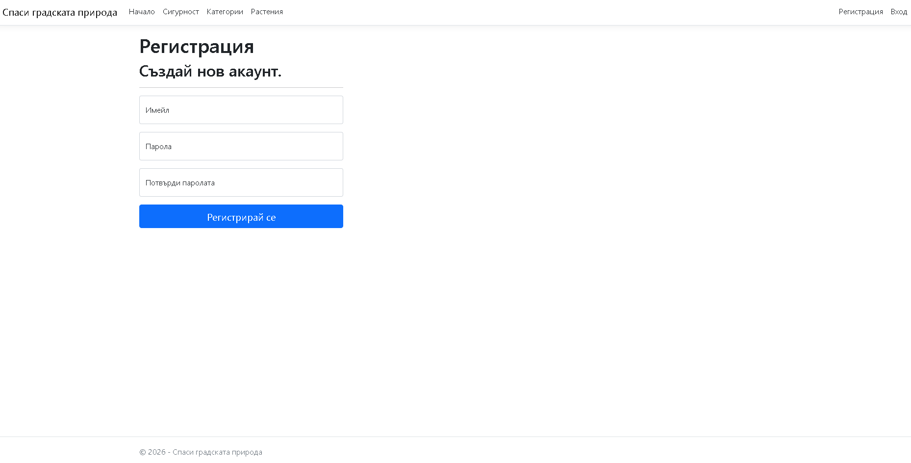

### Страница за вход
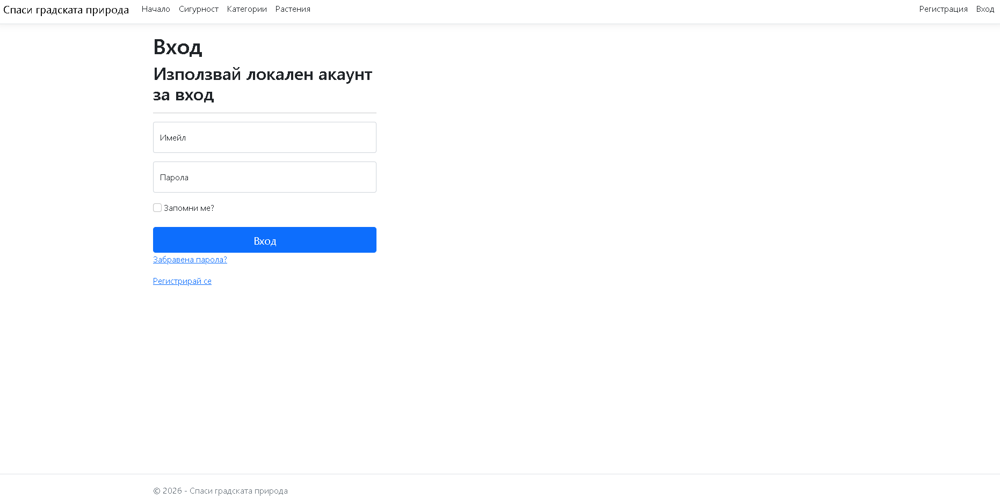

### Категории
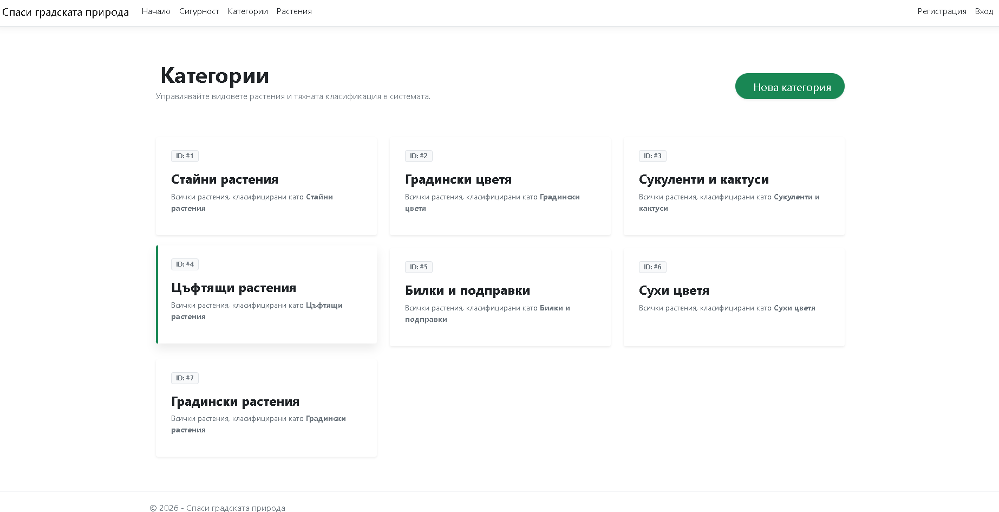

### Добавяне на категории
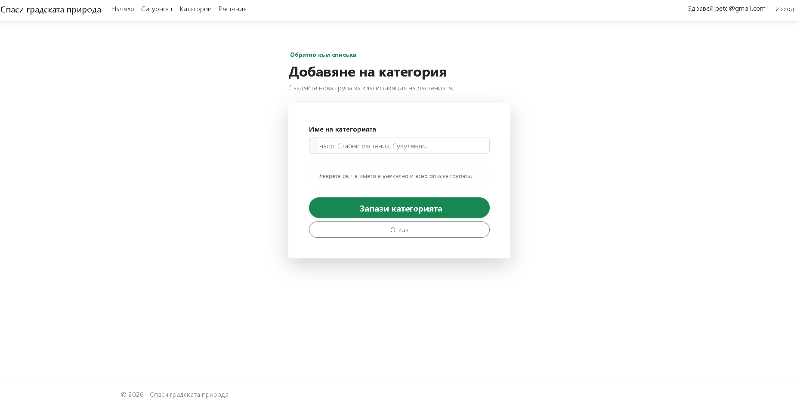

### Списък с Растения(без логнат потребител)
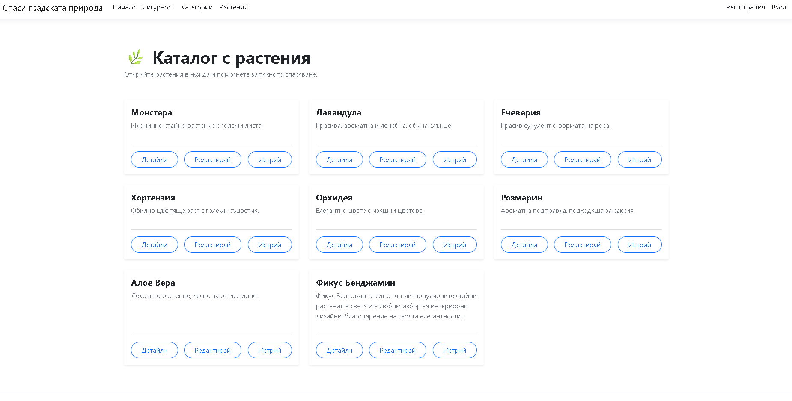

### Списък с Растения(с логнат потребител)
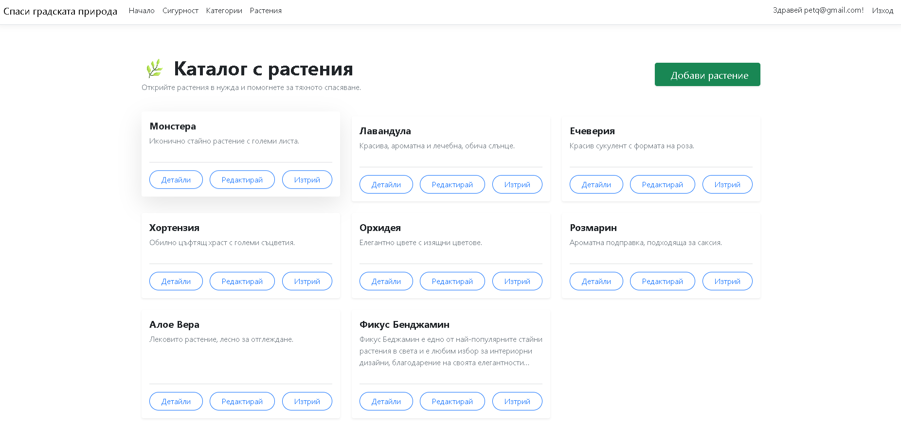

### Добавяне на Растение
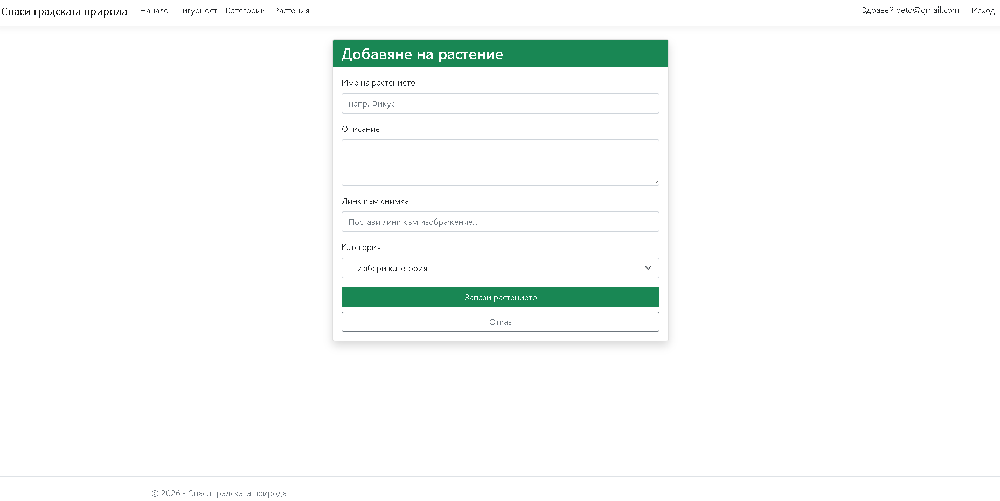

### Детайли за Растение и Заявки
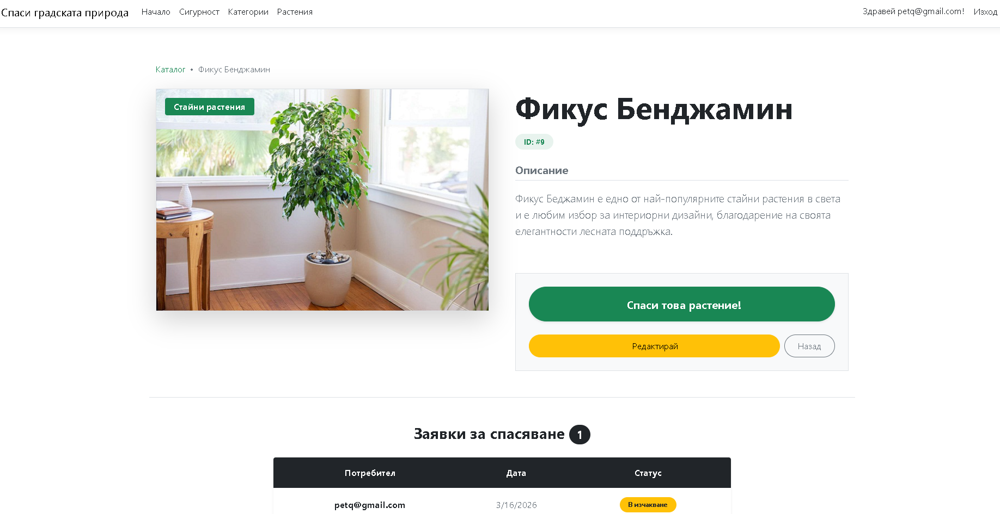

### Редактиране на Растение
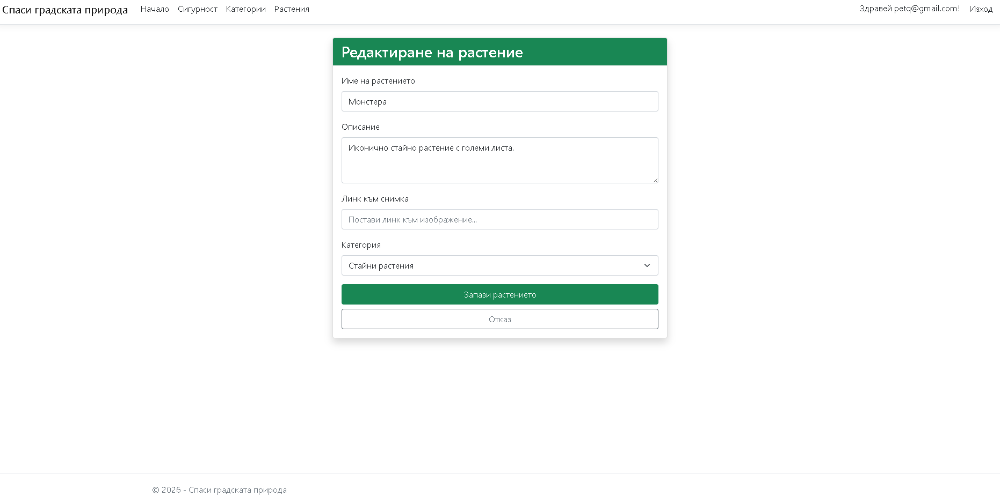

### Изтриване на Растение и Заявки
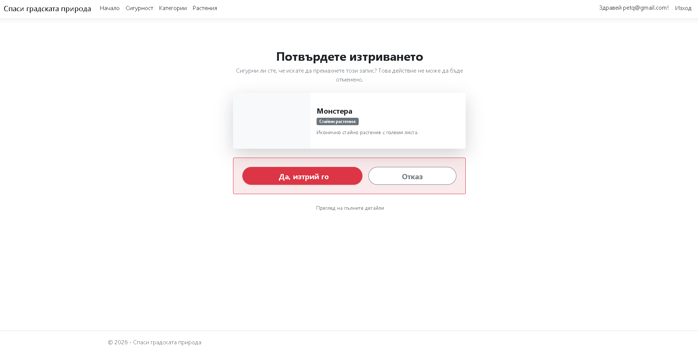

---

## 🛠️ Инсталация и стартиране
1.  **Клонирайте проекта:**
    ```bash
    git clone [https://github.com/victoriabondova/UrbanPlantRescueApp.git](https://github.com/victoriabondova/UrbanPlantRescueApp.git)
2.  **Конфигурирайте базата данни:**
    Променете `ConnectionStrings` в `appsettings.Development.json`, за да сочи към вашия локален SQL Server.
3.  **Приложете миграциите:**
    ```bash
    dotnet ef database update
    ```

---

## 👩‍💻 Автор
**Виктория Бондова**
* GitHub: [@victoriabondova](https://github.com/victoriabondova)
* Проектът е създаден с учебна цел за усвояване на ASP.NET Fundamentals.